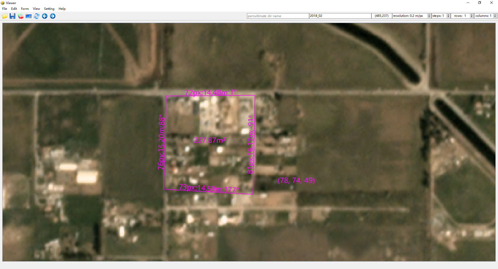

# DiffImg
Visualize and compare multiple images simoultaneously, conveniently, and interactively.



## Keyboard Shortcuts
`e`: Enable/Disable the measurements of line segment lengths and angles.

`v`: Enable/Disable the display of coordinates and RGB values. 

## Conda Environment
```bash
conda create -n diffimg -y python=3.**10**
```
```bash
pip install PySide6 utm easydict rasterio numpy geopandas scikit-image pyyaml pyinstaller tinyaes importlib_metadata nuitka zstandard
```

## Build the project
### PyInstaller
```bash
build.bat
```

### Nuitka
```python
python -m nuitka --follow-imports diffimg.py
```

## Author
Can Song

Shuailin Chen